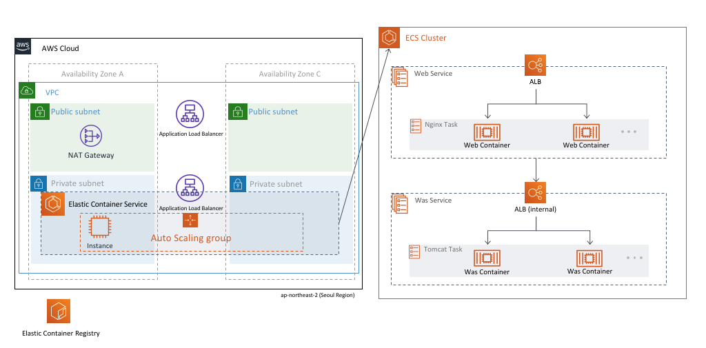
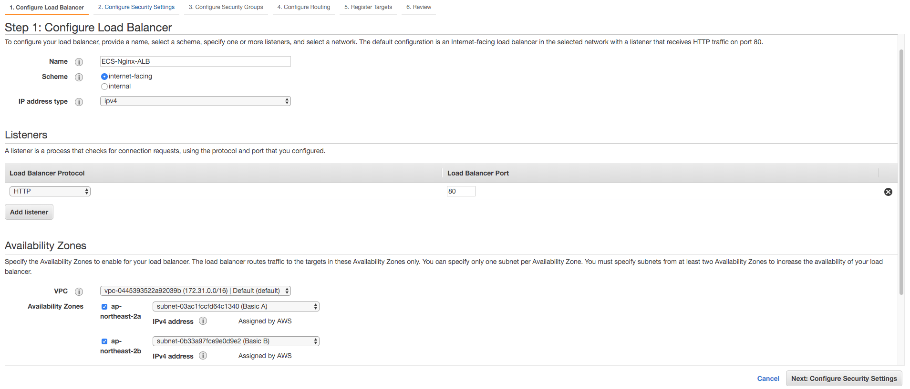
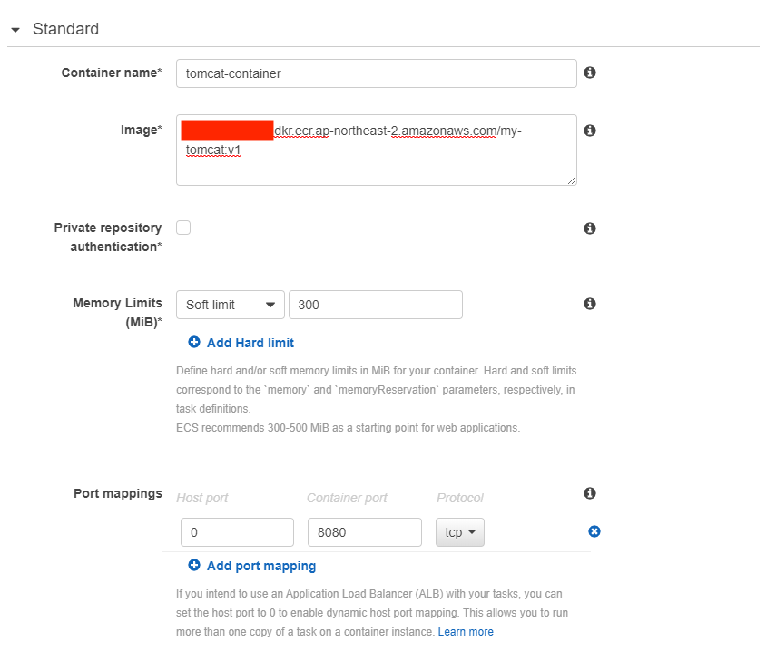
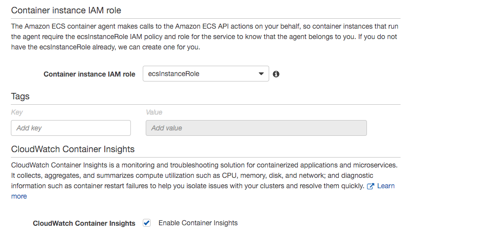

# AWS ECS(Elastic Container Service) Sample Test

## 가정 상황

- Container에 대한 기본적인 지식을 가지고 있음
- AWS에 대한 기초적인 지식을 가지고 있음
- 리전: Seoul (ap-northeast-2)

## 참고 사항

- 환경: macOS Catalina Version 10.15.3
- 비용이 발생할 수 있음

## 아키텍처 (Architecture)



## 사전 설정

### VPC

- Default VPC를 활용

### NAT Gateway

- ECS 인스턴스는 Private Subnet에 위치하기 때문에 ECS Agent와 ECS Management Engine과 통신하기 위해 NAT Gateway가 필요


### IAM Role

- name : ecsInstanceRole


### Secret Group

#### Load Balancer Security Goup

- name: WEB-LB (로드 밸런서의 SG 설정)
- Inbound: HTTP (TCP: 80)


#### ECS Instance Security Goup

- name: ECS-Instance-SG
- Inbound: Custom TCP Rule(TCP: 327680-65535, Dynamic Porting), SSH(TCP: 22)


### Load Balancer

#### ECS Nginx Load Balancer (External)

##### Load Balancer Type (Select: Application Load Balancer)


##### WEB(NGINX)

###### ALB Configure

- name: ECS-Nginx-ALB
- Scheme: Internet-facing
- IP address type: ipv4
- Listeners: HTTP
- VPC: Default VPC
- Available Zones: Public Subnet
- Security Goups : http-lb-sg (custom-sg)



###### Target Configure

- name: ECS-Nginx-tg
- Target type: Instance
- Protocol: HTTP (port: 80)
- Register Target: Pass


##### WAS (Tomcat)

###### ALB Configure

- name: ECS-Tomcat-ALB
- Scheme: Internal
- IP address type: ipv4
- Listeners: HTTP
- VPC: Default VPC
- Available Zones: Private Subnet
- Security Goups : http-lb-sg (custom-sg)

###### Target Configure

- name: ECS-Tomcat-tg
- Target type: Instance
- Protocol: HTTP (port: 80)
- Register Target: Pass

## ECR(Elastic Container Registry)

### Custom Nginx Container

#### Path

```tex
folder path : ./my-nginx (Do not paste!!!)
```

##### Dockerfile

- nginx로 들어오는 트래픽을 tomcat으로 proxy

```dockerfile
FROM nginx:latest
MAINTAINER Ray.H.Li <lhs6395@gmail.com>

COPY default.conf /etc/nginx/conf.d/default.conf

EXPOSE 80
```

- Internal DNS 확인

```bash
aws elbv2 describe-load-balancers | jq -r '.[][1].DNSName'
-> internal-ECS-Tomcat-ALB-1760153505.ap-northeast-2.elb.amazonaws.com (Do not Paste!!!)
```

- 문자열 교환 (제대로 되지 않는 경우 수동으로 바꿔줘야함): tomcat-internal-dns -> ALB internal DNS

```bash
sed -i '' "s/tomcat-internal-dns/$(aws elbv2 describe-load-balancers | jq -r '.[][1].DNSName')/g" default.conf
```

- default.conf


### Nginx Repository

```bash
aws ecr create-repository --repository-name my-nginx --image-scanning-configuration scanOnPush=true
```

- Build Container

```bash
docker build -t my-nginx:v1 .
```

- 계정 확인

```bash
export Account=$(aws sts get-caller-identity | jq -r .Account)
```

- ECR 로그인

```bash
aws ecr get-login-password | docker login --username AWS --password-stdin $Account.dkr.ecr.ap-northeast-2.amazonaws.com/my-nginx
```

- ECR Container Push

```bash
docker tag my-nginx:v1 $Account.dkr.ecr.ap-northeast-2.amazonaws.com/my-nginx:v1
```

```bash
docker push $Account.dkr.ecr.ap-northeast-2.amazonaws.com/my-nginx:v1
```

### Custom Tomcat Container

#### Path

```tex
folder path : ./my-tomcat (Do not paste!!!)
```

##### Dockerfile

- tomcat default 구동

```dockerfile
FROM tomcat:latest
MAINTAINER Ray.H.Li <lhs6395@gmail.com>

RUN cp -a webapps.dist/* webapps/
RUN ./bin/startup.sh

EXPOSE 8080
```

### Tomcat Repository

```bash
aws ecr create-repository --repository-name my-tomcat --image-scanning-configuration scanOnPush=true
```

- Build Container

```bash
docker build -t my-tomcat:v1 .
```

- 계정 확인 (이전에서 했다면 하지 않아도 됨)

```bash
export Account=$(aws sts get-caller-identity | jq -r .Account)
```

- ECR 로그인 (이전에서 했다면 하지 않아도 됨)

```bash
aws ecr get-login-password | docker login --username AWS --password-stdin $Account.dkr.ecr.ap-northeast-2.amazonaws.com/my-nginx
```

- ECR Container Push

```bash
docker tag my-tomcat:v1 $Account.dkr.ecr.ap-northeast-2.amazonaws.com/my-tomcat:v1
```

```bash
docker push $Account.dkr.ecr.ap-northeast-2.amazonaws.com/my-tomcat:v1
```

## TASK Definition

- Console (ECS -> Task Definition -> Create new Task Definition)
- launch type compatibility: EC2

### Configure task and container definitions

#### Nginx

- Task Definition Name: web-task
- Network Mode: Bridge


### Container Definition

#### Add container

- Container name: nginx-container
- Image: <my-account-id>.dkr.ecr.ap-northeast-2.amazonaws.com/my-nginx:v1
- Memory Limits (Soft limit): 300
- Port mappings: (Host port: 0), (Container port: 80), Protocol(tcp)


#### Tomcat

- Task Definition Name: was-task
- Network Mode: Bridge


### Container Definition

#### Add container

- Container name: nginx-container
- Image: <my-account-id>.dkr.ecr.ap-northeast-2.amazonaws.com/my-nginx:v1
- Memory Limits (Soft limit): 300
- Port mappings: (Host port: 0), (Container port: 8080), Protocol(tcp)




## ECS Cluster 생성

- Select cluster template : EC2 Linux + Networking (가장 기본적인 인스턴스 기반으로 동작하는 것으로 진행)
- Cluster name: Sample-cluster
- Provisioning Model : On-Demand Instance
- EC2 Instance type: t3.medium
- Number of instances: 1
- 나머지: Default


- VPC: Default VPC
- Subnet: Private Subnet (인스턴스를 private subnet에 배치)
- Security group: ECS-Insatnce-SG


- Container instance IAM role: ecsInstanceRole

- CloudWatch Container Insights: Enable

  

